# Sports

In my spare time I enjoy practicing a multitude of activities, most of which revolve around sports.

I have been dancing Salsa and Bachata for the last six years on a weekly basis, both attending lessons and enjoying my time in different clubs.

During winter, I spend most of my weekends skiing in the Dolomites and enjoying snow/ice related activities. During summer, I spend most of my weekends mountaneering in the Italian alps, summiting a few peaks here and there.
I also enjoy climbing in my spare time.

**Alpinism**
My friend Marco and I at Capanna Margherita, on top of Mt. Rosa (4554 m).

My friend Marco and I on top of Mt. Adamello (3539 m).

My friend Marco and I on top of Mt. Cevedale (3769 m).

A shot while climbing the Ferrata Bolver Luigi in the Pale of San Martino group.

You can click on my Flickr account to see pictures from some of my adventures (shot with a Sony RX100-III), or on my Youtube channel for the related videos (shot with the GoPro10). 

**Landscape Photography**
Sunset and nightsky in Yellowstone, California.
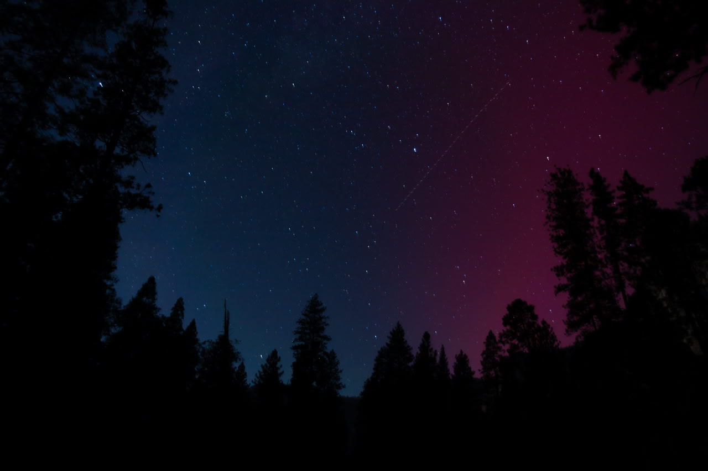
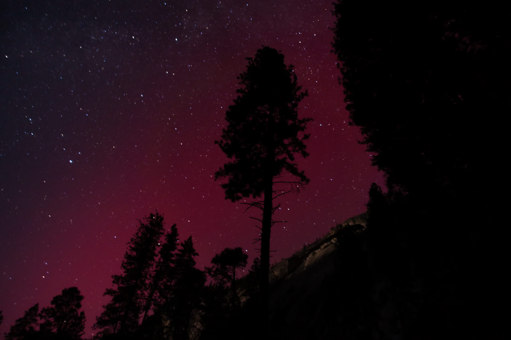
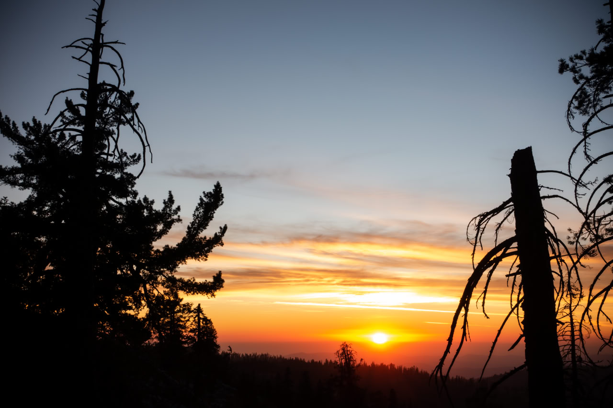
Shots from Punta Gniffetti, on top of Mt. Rosa, Italy.
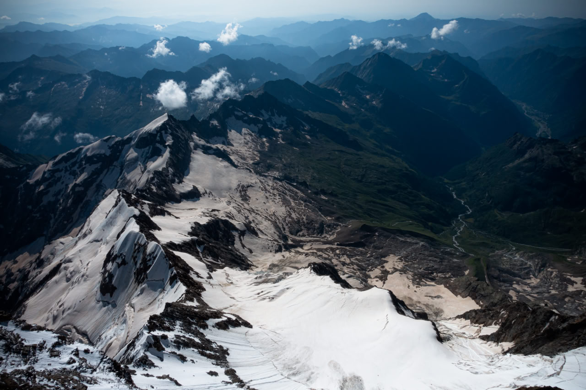
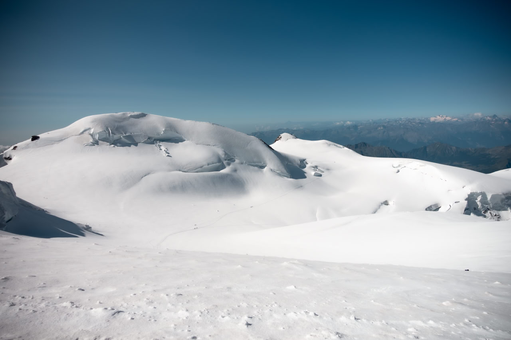
A golden sunset shot from Santa Barbara beach, California.
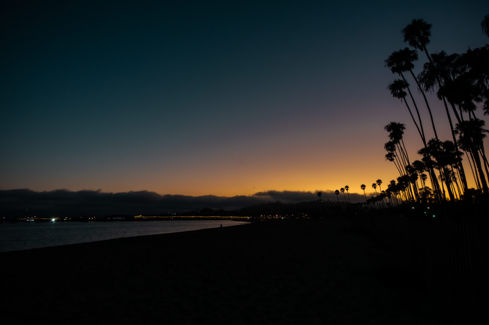
Two great sunrise shots from Marmolada, Italy.
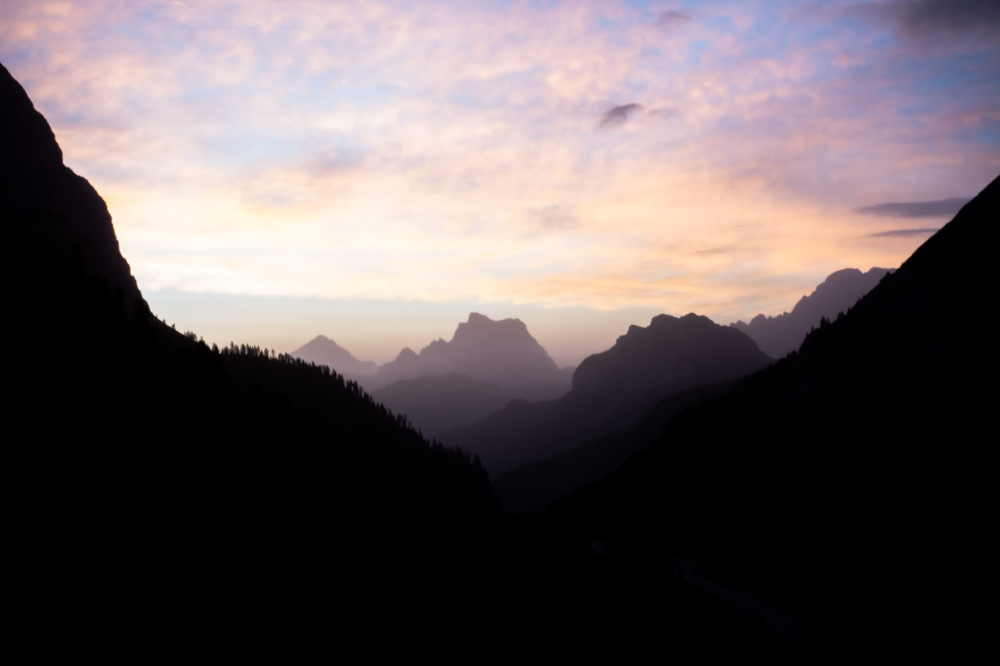
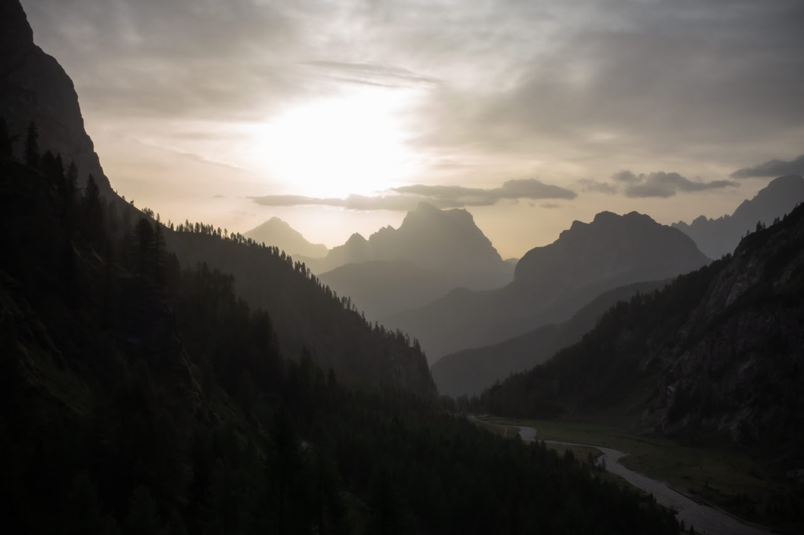
An artistic shot of the beautiful Cortina and the surrounding Cadore valley, with the frozen Croda da Lago lake.
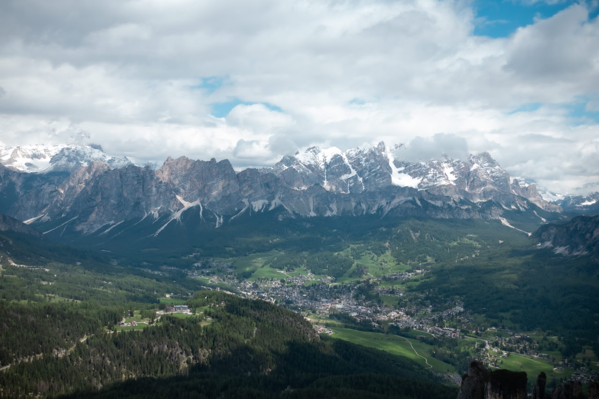
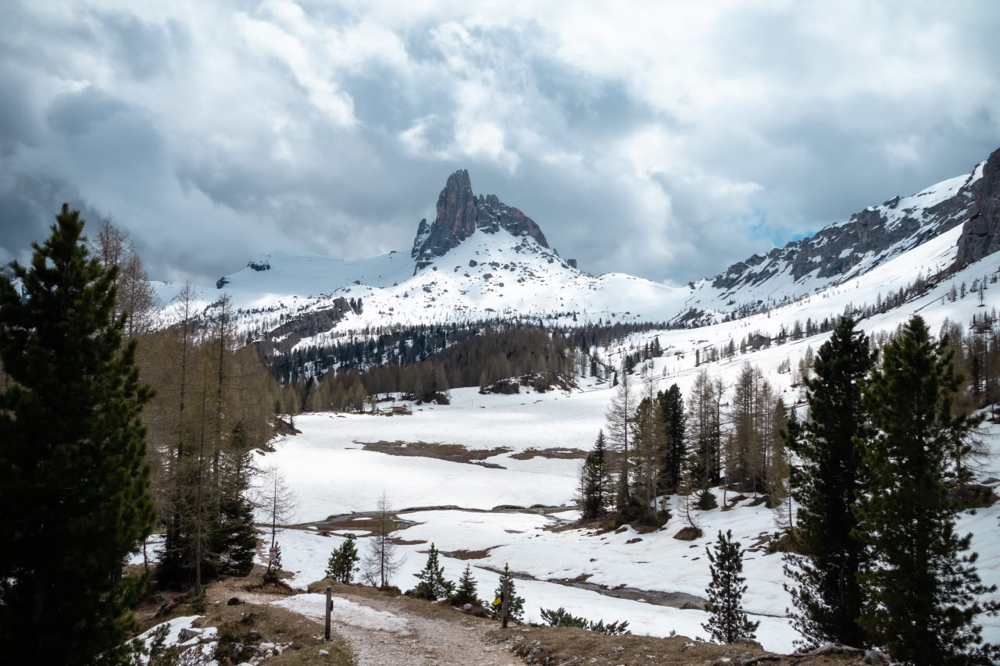
Emerging tree on Plitvice lake.
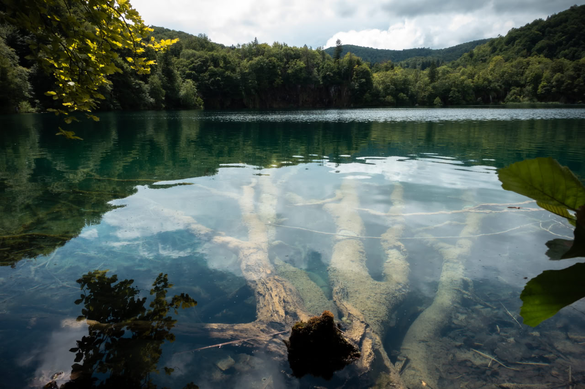

# Music

I consider myself an eclectic listener.

Mostly, you can find me listening to instrumental music that ranges from techno to metal, passing through classical music and jazz.

