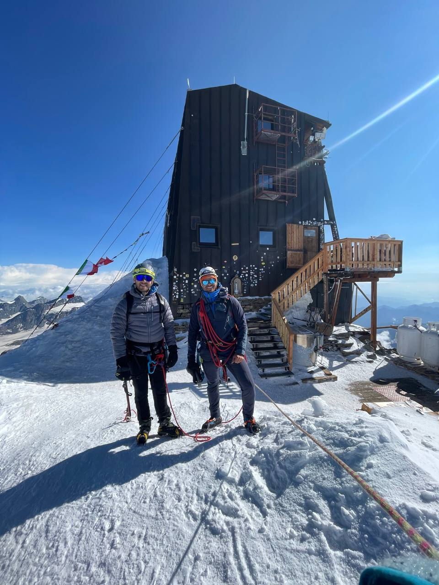
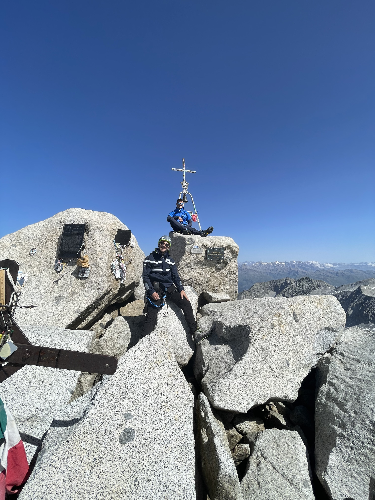
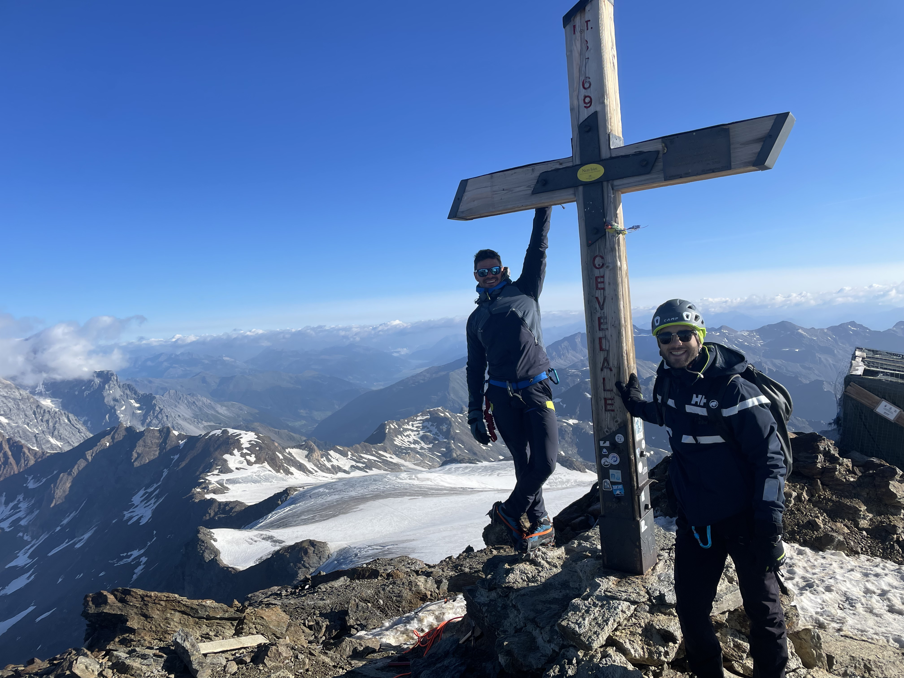
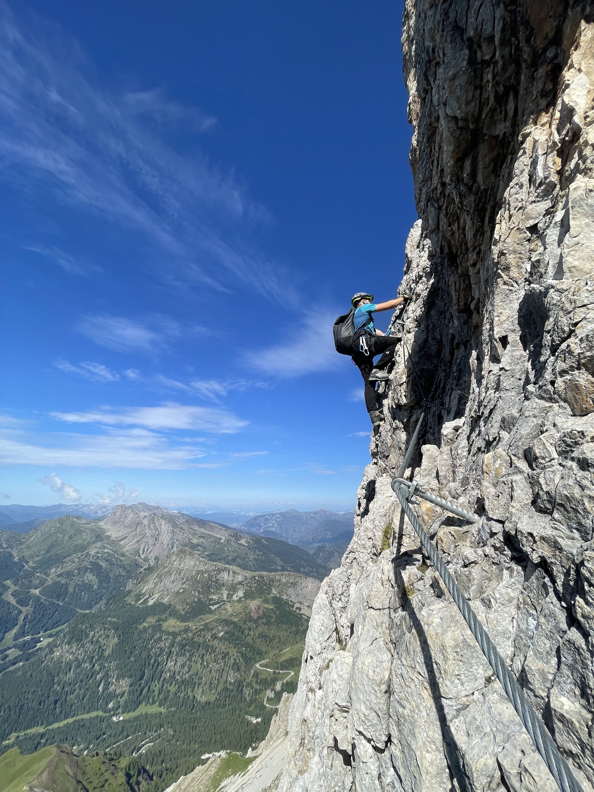

# Sports

In my spare time I enjoy practicing a multitude of activities, most of which revolve around sports.

I have been dancing Salsa and Bachata for the last six years on a weekly basis, both attending lessons and enjoying my time in different clubs.

During winter, I spend most of my weekends skiing in the Dolomites and enjoying snow/ice related activities. During summer, I spend most of my weekends mountaneering in the Italian alps, summiting a few peaks here and there.
I also enjoy climbing in my spare time.

**Alpinism**

You can click on my Flickr account to see pictures from some of my adventures (shot with a Sony RX100-III), or on my Youtube channel for the related videos (shot with the GoPro10). 

# Music

I consider myself an eclectic listener.

Mostly, you can find me listening to instrumental music that ranges from techno to metal, passing through classical music and jazz.

